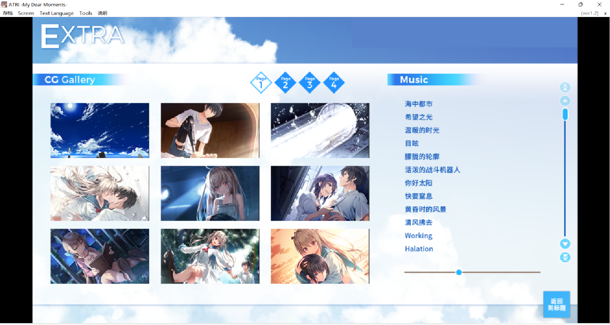

# 每日3件幸福的事

#### 介绍
Mandarin HW

#### 记录0905
- 和爸爸讨论学校作业
- 看完FrontWing推出的[《ATRI -MY DEAR MOMENTS-》](https://zh.moegirl.org.cn/ATRI_-My_Dear_Moments-)，非常感动，让我对A.I.的发展产生了新的思考（既然仿生人可以拥有“心”，那它们可以称为人吗，人类又为什么要创造它们）
- 父母为我多准备了100元饭费让我改善伙食

